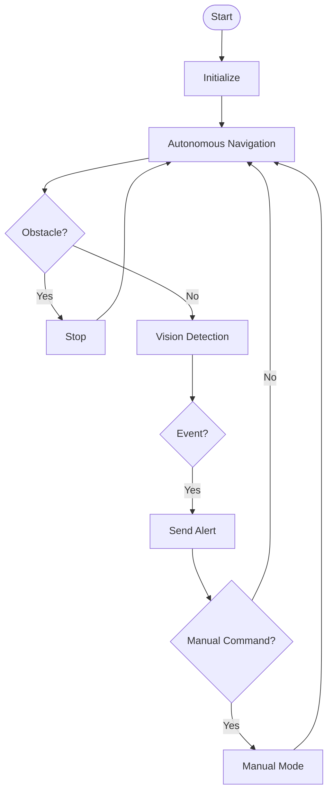

# WatchRover: IoT-Enabled Autonomous Disaster Response Robot

## Overview
WatchRover is an IoT-enabled autonomous ground robot designed for disaster response and rough terrain navigation. It integrates autonomous navigation, real-time telemetry, edge-based vision processing, and human-in-the-loop control.

## Key Features
- Autonomous navigation using LiDAR and sensor fusion
- Rough terrain mobility (6-wheel skid-steer)
- Edge AI vision (YOLO11n)
- IoT telemetry and remote monitoring
- Hybrid control (autonomous + manual)
- Fire, human, and SOS gesture detection
- Environmental sensing
- Live video streaming

## Flowchart

## Hardware
- ESP32
- LiDAR
- IMU
- Encoders
- ESP32-CAM
- Gas sensors
- DC motors
- Motor drivers
- Li-ion battery

## Performance
- Speed: 0.32 m/s
- Obstacle detection: up to 1.8m
- Vision accuracy: ~90%
- Communication: 30m range
- Runtime: 1.5–2 hours

## Future Work
- Thermal camera
- Mesh networking
- Multi-robot system

